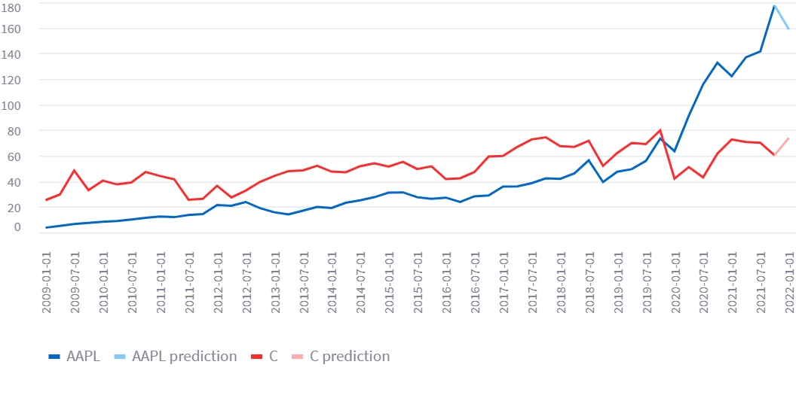

# S&P500 stocks relation

At first sight, I think there are 2 tasks: predict future stock price and regress one based on the others, so that when one stock change is predicted, we can know how much it affects the other. I spent one day searching for such technique but found no useful material.

Therefore, I'll just build a machine learning model to predict future stock price and draw a chart of stocks price change over time.

There are 5 main steps:
- Crawl data
- Preprocess data and train our model
- Test our model and predict stock price in 2022
- Build an API that return our prediction
- Build a streamlit application to visualize stocks price over time. 

Below are folder structure of this project and each step in details.
### Folder structure
```
snp500    
│
└───data
│   │   ticker_*.csv
└───model
│   │   crawler.py
│   │   params.yaml
│   │   predict2022.py
│   │   prediction2022.csv
│   │   preprocess.py
│   │   scaler.gz
│   │   test.py
│   │   train.py
└───saved_model
│   │   model.pt
│   .env
│   .gitignore
│   api.py
│   db_connect.py
│   documentation.md
│   README.md
│   requirements.txt
│   streamlit_app.py
```

## Crawl data

Run `model/crawler.py` to crawl list of S&P500 symbols from Wikipedia and download each symbol's historical data using [yfinance](https://pypi.org/project/yfinance/) as `.csv` files to `data/`.

Each symbol's historical data consists of 6 fields: Open, High, Low, Close, Adj Close, Volume recorded each 3 months from 2009 to 2021. There are also options of smaller interval (from 1 day to 3 months).

Some symbol's beginning recorded time is closer, i.e. 2015 or 2019. This make the idea of having a model which take all stocks' performance as one input and output all stocks price at once is not feasible. Therefore, I'll build a common model which apply for each stock individually. 

## Preprocess data and train our model

I will use the traditional model, LSTM to handle our time series data.

### Preprocess data

Since we have multiple stocks data, combining them together is a bit tricky. We can not concatenate one to the bottom of the other one because they are not continuous values of the same stock. We'll just keep them as a list of time series and handle them carefully in `__get_item__` method.

After splitting data into training set and test set, we need to rescale them so that they lie on [0, 1] interval. This is done by `MinMaxScaler` of [scikit-learn](https://scikit-learn.org/). I fit that scaler on training set and save it to `model/scaler.gz` for applying on test set later.

### Model training

After running `model/train.py`, our model will be saved to `saved_model/model.pt`.

## Test out model and predict stock price in 2022

### Test our model

Run `model/test.py`, the output is:

```
Error on all test data:
RMSE:  85.49
MAE:  24.12
```

That is not a good score, but due to limited time I won't try improving our model.

### Predict stock price in 2022

Run `model/predict2022.py` and the result will be saved to `model/prediction2022.csv` as well as our Mongo database. 

## Mongo database usage

From this step, there will be MongoDB usage. Previous steps do not involve database but instead working with `.csv` file only as it is familiar when building a machine learning model.

The script to connect to MongoDB is in `db_connect.py`. As this project is small, other steps will get database instance from this file and handle logic on its own instead of having complex architecture.

There are 2 collections in our database: `historical-data` and `prediction-2022`.

Example record in `historical-data` collection:
```
{
    "ticker": "A",
    "historical_data": {
        "Open": {"2009-01-01": 11.158798217773438,...},
        "High": ...,
        ...
    }
}
```

Example record in `prediction-2022` collection:
```
{
    "ticker": "A",
    "prediction": 171.40100464162526
}
```

## Build an API that return our prediction

This API is implemented using FastAPI. It just retrieves our pre-calculated prediction from database and output it.

To run the server:
```
uvicorn api:app
```

For example, calling `http://127.0.0.1:8000/prediction-2022/?ticker=AAPL&n=10` results in:

```
{"message":"success","result":{"ticker":"AAPL","prediction":158.81275204254803}}
```

## Build a streamlit application to visualize stocks price over time

To run the app:
```
streamlit run streamlit_app.py
```

Input a list of symbols separated by space and enter to see the chart of stocks price over time and prediction in 2022.

For example, the chart corresponding to `AAPL C` is:


As you can see, the predictions have different color. This is done by treating the prediction as a different line but connect to the original line by adding the last point as a dummy point before prediction.